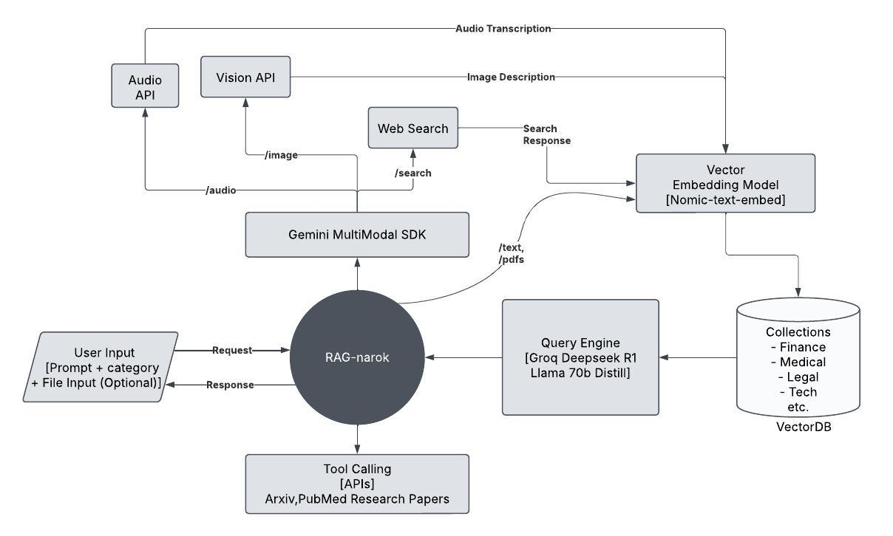

# RAGnarok  
> Fast and modern RAG powered research and documentation assistant for professionals

### Tech Stack


## Overview

The project consists of four main components:

- **Ingestion Pipeline**  
  Reads documents (PDFs, text, markdown), splits and vectorizes them, and stores embeddings in a vector database (e.g. Pinecone, Weaviate).

- **Backend API**  
  A FastAPI service exposing endpoints for querying the vector store, invoking SoTa LLMs such as Deepseek, and streaming chat responses.

- **Frontend UI**  
  A NextJS + Typescript chat interface that calls the Backend API for conversational RAG.

- **Deployment Manifests**  
  Dockerfiles and Docker Compose manifests to deploy entire project locally or in the cloud.



## Prerequisites

- **Docker & Docker Compose**  
- **Node.js** (v20+) and **Bun**  
- **Python** (v3.11+)  
- **LLM API key** (Groq, Gemini, etc.)  
- **[AstraDB](https://www.datastax.com/lp/vector-database) Vector database credentials**  

## Project Structure
```
.
├───.github
│   └───workflows
├───assets
├───backend
│   └───app
│       ├───models
│       ├───routes
│       ├───services
│       └───utils
├───deployment
├───frontend
│   ├───public
│   └───src
│       ├───app
│       │   └───test
│       ├───components
│       │   └───ui
│       ├───context
│       └───lib
└───ingestion-pipeline

20 directories, 65 files
```

## Setup

1. **Clone the repo**  
   ```bash
   git clone https://github.com/3xCaffeine/rag.git
   cd rag
   ```
2. Configure environment variables

    Copy the example `.env.example` into each service folder and add the API keys, URLs and AstraDB database credentials.

3. Build & run with Docker Compose

    ```
    docker-compose up -d
    ```
> [!NOTE]  
> In case GPU support is unavailable on the machine, utilize a hosted text embedding model (OpenAI Ada, Jina AI, Cohere etc.) and remove the Ollama section from the Compose config.

4. (Optional) For remote deployment with custom domains, configure the `deployment/Caddyfile` otherwise remove the Caddy section from Compose configuration.

### Expected Result

```bash
$ docker compose ps
NAME            IMAGE                  COMMAND                  SERVICE   CREATED         STATUS                   PORTS
backend-api-1   ragbackend:latest      "fastapi run app/mai…"   api       3 minutes ago   Up 3 minutes (healthy)   0.0.0.0:8000->8000/tcp
ollama          ollama/ollama:latest   "/bin/sh ./run_model…"   ollama    9 seconds ago   Up 9 seconds             0.0.0.0:11434->11434/tcp
```

## Usage

Visit Ragnarok chat at http://localhost:3000.


### Demo


## Authors
This project was built for the AISoC Chronos Hackathon 2025 by the 3xCaffeine team.

- Sourasish Basu ([@SourasishBasu](https://github.com/SourasishBasu))
- Swapnil Dutta ([@rycerzes](https://github.com/rycerzes))
- Vaibhav Singh ([@monkeplication](https://github.com/monkeplication))
- Shourya Merchant ([@dotpixel123](https://github.com/dotpixel123))

## Version
| Version | Date          		| Comments        |
| ------- | ------------------- | --------------- |
| 1.0     | May 14th, 2025      | Revised release |